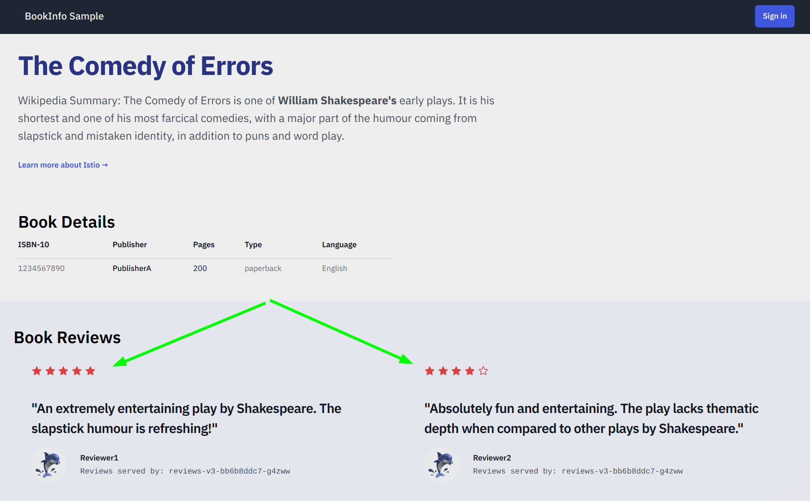

**Bookinfo** is the Istio sample application used throughout the [Istio documentation](https://istio.io/latest/docs/examples/bookinfo/). 

The Bookinfo application is broken into four separate microservices:

* The **productpage** microservice calls the details and reviews microservices to populate the page.
* The **details** microservice contains book information.
* The **reviews** microservice contains book reviews. It also calls the ratings microservice.
* The **ratings** microservice contains book ranking information that accompanies a book review.

This is the end-to-end architecture of the application:


  
There are 3 versions of the reviews microservice:
* **Version v1** doesn’t call the ratings service.
* **Version v2** calls the ratings service and displays each rating as 1 to 5 black stars.
* **Version v3** calls the ratings service and displays each rating as 1 to 5 red stars.

This application is polyglot, i.e., the microservices are written in different languages. It’s worth noting that these services have no dependencies on Istio, but make an interesting service mesh example, particularly because of the multitude of services, languages and versions for the reviews service.

## Deploying Bookinfo

To run the sample with Istio requires no changes to the application itself. Instead, you simply need to configure and run the services in an Istio-enabled environment: 

In the previous Exercise 1, section "Installing Istio", the last step was to label the `default` namespace with `istio-injection=enabled`. With this label in place, every pod deployed into the `default` namespace gets an "Envoy" sidecar injected along side each service. The resulting deployment will look like this:


This picture also shows that external communication will pass through the Istio Ingress and its associated Ingress Envoy.

## 1 Deploy the application:

```
kubectl apply -f samples/bookinfo/platform/kube/bookinfo.yaml
```

Confirm all services and pods are correctly defined and running:

```
kubectl get svc

NAME          TYPE        CLUSTER-IP       EXTERNAL-IP   PORT(S)    AGE
details       ClusterIP   10.110.11.198    <none>        9080/TCP   5s
kubernetes    ClusterIP   10.96.0.1        <none>        443/TCP    49m
productpage   ClusterIP   10.111.168.190   <none>        9080/TCP   5s
ratings       ClusterIP   10.101.65.227    <none>        9080/TCP   5s
reviews       ClusterIP   10.105.10.132    <none>        9080/TCP   5s
```

and

```
kubectl get pod

NAME                             READY     STATUS    RESTARTS   AGE
details-v1-79f774bdb9-wvjr9       2/2     Running   0          89s
productpage-v1-6b746f74dc-zpwbk   2/2     Running   0          88s
ratings-v1-b6994bb9-cr2w4         2/2     Running   0          89s
reviews-v1-545db77b95-7mv2b       2/2     Running   0          89s
reviews-v2-7bf8c9648f-47mfv       2/2     Running   0          89s
reviews-v3-84779c7bbc-rcbr9       2/2     Running   0          89s
```

Note container count in the 'READY' column. It shows 2 of 2 (2/2). This is an indication that the Envoy proxies have been added automatically to the pods.

## 2 Allow external access to application:

Now that the Bookinfo services are up and running, you need to make the application accessible from outside of your Kubernetes cluster, e.g. from a browser. In this lab we will not use NodePorts in the Kubernetes service definitions. Instead an Istio Gateway is used for this purpose.

1. Create Istio gateway definition:

    ```
    kubectl apply -f samples/bookinfo/networking/bookinfo-gateway.yaml
    ```

    We will see in detail what is created by this command in exercise 4 of this workshop.

2. Create a LoadBalancer in Minikube: 

    Check the external IP address of the Istio ingressgateway:

    ```
    kubectl get service -n istio-system | grep ingress
    
    istio-ingressgateway   LoadBalancer   10.107.101.80  <pending> ...   
    ```

    It will show 'pending' for the external IP address. The ingressgateway is a Kubernetes service of type LoadBalancer. A real Load Balancer is not available on Minikube (hence the 'pending' status), but we can fake one.


    **Note:** In public managed cloud environments (e.g. IBM Cloud) a Kubernetes service of type LoadBalancer usually gets a public (= routable in the Internet) IP address assigned automatically if one is available in the account. You can then map this public IP address to a fully qualified domain name (FQDN) in the DNS (Domain Name System) and make your Istio Ingress controller answer HTTP requests via the Internet. 


    In a **new terminal session** enter:

    ```
    minikube tunnel
    ```

    When requested, authenticate with your root password. **Keep this session open and active!**

    Now repeat the command:

    ```
    kubectl get service -n istio-system | grep ingress
    
    istio-ingressgateway   LoadBalancer   10.107.101.80    10.107.101.80  ...   
    ```

    You can see that the LoadBalancer now has an external IP address which identical to the internal (CLUSTER-IP) one. Thanks to the 'minikube tunnel' still running in the other session, this internal address is suddenly reachable from your workstation. 

3. Access the Bookinfo application:

   ```
   export INGRESS_HOST=$(kubectl -n istio-system get service istio-ingressgateway -o jsonpath='{.status.loadBalancer.ingress[0].ip}')
   export INGRESS_PORT=$(kubectl -n istio-system get service istio-ingressgateway -o jsonpath='{.spec.ports[?(@.name=="http2")].port}')
   echo http://$INGRESS_HOST:$INGRESS_PORT/productpage
   ```

    The result of the last command is the URL for your instance of the Bookinfo application, e.g. `http://10.107.101.80:80/productpage`.

    Open this URL in your browser and you should see the Bookinfo application in all its splendour:

    

    Refresh the page several times and watch Book Reviews section: 
    * no stars = reviews-v1
    * black stars = reviews-v2
    * red stars = reviews-v3

    **Keep your browser open on this page!**

---

## >> [Continue with Exercise 3](exercise3.md)