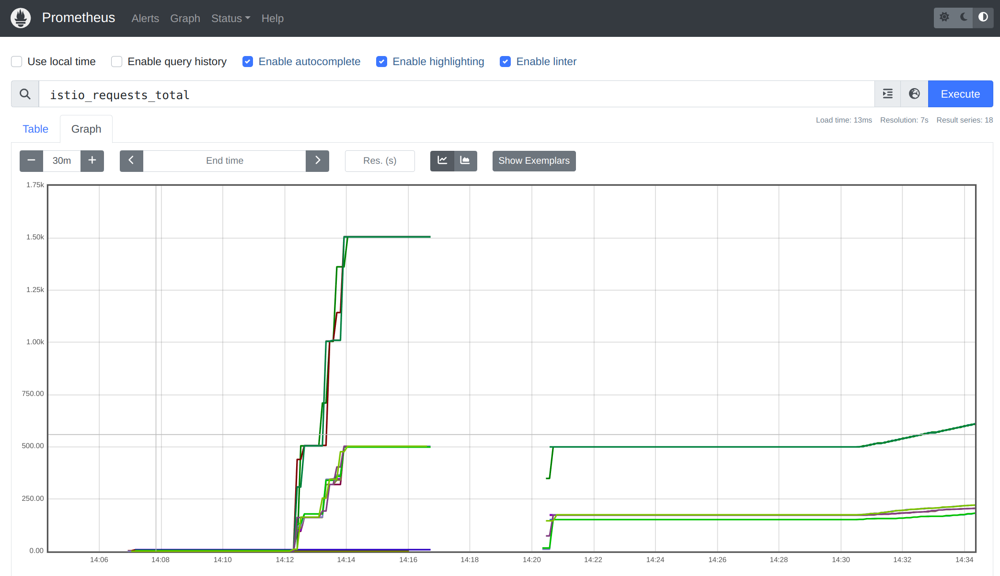
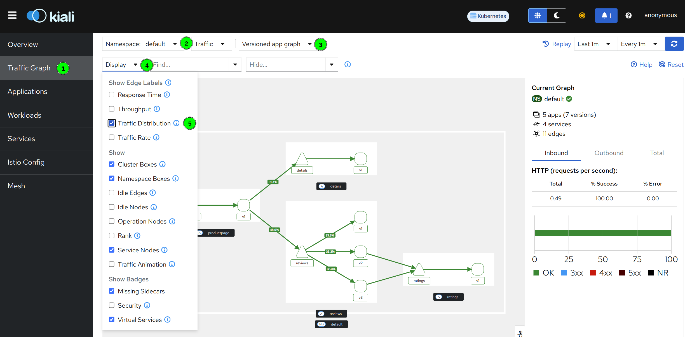
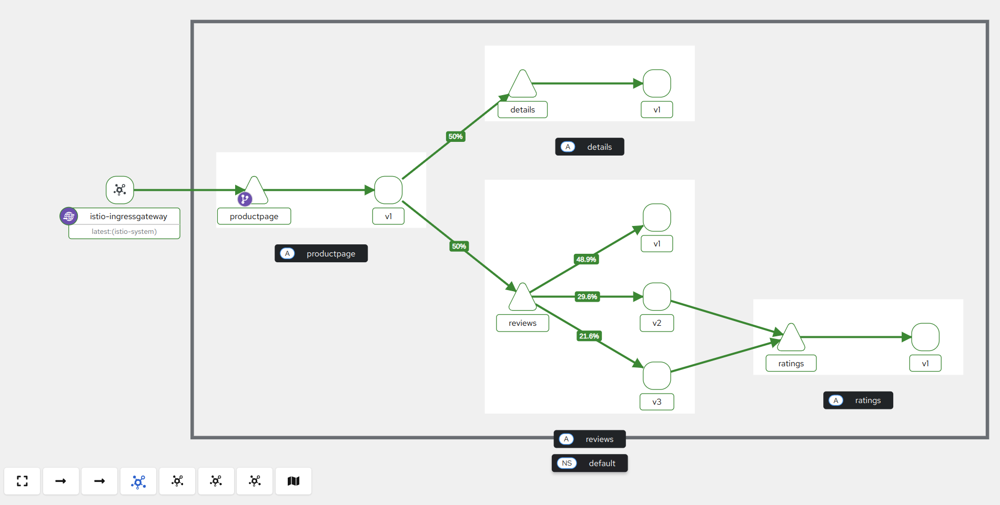
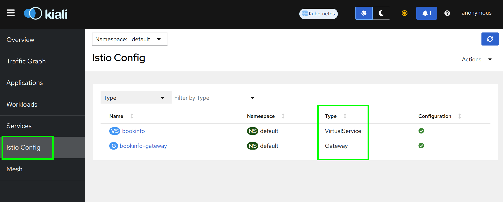

## Challenges with microservices

We all know that a microservice architecture is possibly the most perfect fit for cloud native applications and it increases the speed of delivery greatly. But envision you have many microservices that are delivered by multiple teams. How do you observe the overall platform and each of the services to find out exactly what is going on with each of the services? When something goes wrong, how do you know which service or which communication among the services is causing the problem?

## Istio telemetry

Istio integrates very well with a range of (open-source) telemetry and observability tools that can provide broad and granular insight into the health of all services. Istio’s role as a service mesh makes it the ideal data source for observability information, particularily in a microservices environment. 

As requests pass through multiple services, identifying performance bottlenecks becomes increasingly difficult using traditional debugging techniques. Distributed tracing using e.g. Jaeger provides a holistic view of requests transiting through multiple services, allowing for immediate identification of latency issues. With Istio, distributed tracing comes by default. This will expose latency, retry, and failure information for each hop in a request.

In Exercise 1, you have installed 4 telemetry or observability add-ons: 

* [Prometheus](https://istio.io/latest/docs/ops/integrations/prometheus/){:target="_blank"} (for Monitoring)
* [Grafana](https://istio.io/latest/docs/ops/integrations/grafana/){:target="_blank"} (for Monitoring)
* [Jaeger](https://istio.io/latest/docs/ops/integrations/jaeger/){:target="_blank"} (for Distributed Tracing)
* [Kiali](https://istio.io/latest/docs/ops/integrations/kiali/){:target="_blank"} (the Istio dashboard)

There is a whole section on [Observability](https://istio.io/latest/docs/tasks/observability/){:target="_blank"} in the Istio documentation.

## Accessing the Telemetry services

Look at the installed Telemetry services:

```
kubectl get svc -n istio-system
```

### Jaeger

Jaeger needs some additional configuration.

Install an extension provider referring to the Jaeger collector service.

Start by [downloading](../files/tracing.yaml){:target="_blank"} (download to the istio directory) or creating a tracing.yaml file with this content:

```
apiVersion: install.istio.io/v1alpha1
kind: IstioOperator
spec:
meshConfig:
    enableTracing: true
    defaultConfig:
    tracing: {} # disable legacy MeshConfig tracing options
    extensionProviders:
    - name: jaeger
    opentelemetry:
        port: 4317
        service: jaeger-collector.istio-system.svc.cluster.local
```

Then apply it:

```
bin/istioctl install -f ./tracing.yaml --skip-confirmation
```

Result should look like this:

```
        |\          
        | \         
        |  \        
        |   \       
      /||    \      
     / ||     \     
    /  ||      \    
   /   ||       \   
  /    ||        \  
 /     ||         \ 
/______||__________\
____________________
  \__       _____/  
     \_____/        

✔ Istio core installed ⛵️                                                                                                                             
✔ Istiod installed 🧠                                                                                                                                 
✔ Ingress gateways installed 🛬                                                                                                                       
- Pruning removed resources                                                                                                                             Removed apps/v1, Kind=Deployment/istio-egressgateway.istio-system.
  Removed /v1, Kind=Service/istio-egressgateway.istio-system.
  Removed /v1, Kind=ServiceAccount/istio-egressgateway-service-account.istio-system.
  Removed rbac.authorization.k8s.io/v1, Kind=RoleBinding/istio-egressgateway-sds.istio-system.
  Removed rbac.authorization.k8s.io/v1, Kind=Role/istio-egressgateway-sds.istio-system.
  Removed policy/v1, Kind=PodDisruptionBudget/istio-egressgateway.istio-system.
✔ Installation complete     
```

To enable tracing, [download](../files/telemetry.yaml){:target="_blank"} or create the following file `telemetry.yaml`:

```
apiVersion: telemetry.istio.io/v1
kind: Telemetry
metadata:
name: mesh-default
namespace: istio-system
spec:
tracing:
- providers:
    - name: jaeger
```    

Then apply it:

```
$ kubectl apply -f telemetry.yaml

```

Check if it worked:

```
telemetry.telemetry.istio.io/mesh-default created
```

Access the Jaeger UI using the following command:

```
bin/istioctl dashboard jaeger 
```

This will open the Jaeger dashboard.

To see trace data, you must send requests to the Bookinfo application. The number of requests depends on Istio’s sampling rate and can be configured using the Telemetry API. With a default sampling rate of 1%, you need to send at least 100 requests before the first trace is visible. To see some trace data in Jaeger send 500 requests to the Productpage service of Bookinfo using the following commands. They will take a while to complete:


```
export INGRESS_HOST=$(kubectl -n istio-system get service istio-ingressgateway -o jsonpath='{.status.loadBalancer.ingress[0].ip}')
export INGRESS_PORT=$(kubectl -n istio-system get service istio-ingressgateway -o jsonpath='{.spec.ports[?(@.name=="http2")].port}')
for i in $(seq 1 500); do curl -s -o /dev/null "http://$INGRESS_HOST:$INGRESS_PORT/productpage"; done
```

1. Back in the Jaeger dashboard,refresh your browser
1. Select 'istio-ingressgateway.istio-system' as a service in the left-hand pane.
2. Click on 'Find Traces'.

    

   Note the term "Spans" for each trace entry:

   In distributed tracing, a trace is a view into a request as it moves through a distributed system (from microservice to microservice). A span is a named, timed operation that represents a part of the workflow. Multiple spans are pieced together to create a trace. 

   Some of our traces have 8 spans, some only 6. In Version 2 and 3 of the Reviews service the Reviews service calls the Ratings service, in Version 1 it doesn't. Hence the different number of spans. 

3. Click on one of the trace entries to see the details:

    

    On the left side you can see how the request is passed through the different services: coming in via Istio Ingress, Productpage to Details, back to Productpage, Productpage to Reviews, Reviews to Ratings. An the graph shows how much time is being spent in each service.

Close the Jaeger dashboard and terminate the `bin/istioctl dashboard jaeger` command.

### Prometheus

For the other telemetry services we need to generate constant load on your Bookinfo instance. In a terminal session enter the following commands:

```
export INGRESS_HOST=$(kubectl -n istio-system get service istio-ingressgateway -o jsonpath='{.status.loadBalancer.ingress[0].ip}')
export INGRESS_PORT=$(kubectl -n istio-system get service istio-ingressgateway -o jsonpath='{.spec.ports[?(@.name=="http2")].port}')
watch curl http://$INGRESS_HOST:$INGRESS_PORT/productpage
```

Keep this running during the rest of this exercise 3.

Open the Prometheus dashboard in your browser:

```
bin/istioctl dashboard prometheus
```

2. In the Query field start to type 'istio_requests_total'. When you start to type, Prometheus will generate a list of predefined metrics queries.
3. Select 'istio_requests_total', the click 'Execute' and select the 'Graph' tab.

    

    It is a cumulative graph of all requests:

    

    The left part of the graph (steep curve) are the requests we created to see traces in Jaeger, the right part of the graph are the requests we create every two seconds with the "watch" command above to create load. When you refresh the browser you may notice that the curve is rising.

When you are finished with Prometheus, close the Prometheus dashboard in your browser and terminate the "istioctl dashboard prometheus" command (Linux: Ctl+C, Mac: Cmd+C)

### Grafana

Open the Grafana dashboard:

```
bin/istioctl dashboard grafana 
```

2. Click on the "Hamburger"menu" (1), then on "Dashboard" (2)

    

3. From the list of dashboards select the "Istio Performance Dashboard"

    

    This is general performance information collected from the service mesh:

    

3. Look at the other Grafana Dashboards.    

**Note:** In some of the dashboards you can see a "datasource" selector. There is a default data source selected. When you click on the pulldown you can see that there is one (1) datasource available and that is Prometheus. This means that Grafana needs the Prometheus data to display its dashboards.

When you are finished with Grafana, terminate the istioctl command (Linux: Ctl+C, Mac: Cmd+C)

### Kiali

Open the Kiali dashboard:

```
bin/istioctl dashboard kiali
```

1. In a browser open the Kiali dashboard at [http://localhost:20001/](http://localhost:20001/)
2. Click on the 'Traffic Graph' tab (1), select the 'default' namespace (2), select 'Versioned app graph' (3),  and in the 'Display' pulldown (4), check 'Traffic Distribution' (5):

    

3. You can now see a graphical representation of your micro services including the distribution of requests amongst your services.
    Watch the distribution of requests amongst the 3 versions the Reviews service: 1/3 = 33.3 % should go to each of the versions, that is the default equal distribution or "round robin". **Note:** Kiali needs to be active for a while to show a somewhat equal distribution. In my screenshot, the v1 version is preferred and gets almost half the requests. 
    Also note that only v2 and v3 are making requests to the Ratings service.

    

4. Click on the 'Istio Config' tab:

    

    Here you can see the Istio specific configuration applied to your microservices. In Exercise 2, step '2 Allow external access to application' you deployed a configuration from file 'samples/bookinfo/networking/bookinfo-gateway.yaml'. This YAML contains the specifications for the Gateway and VirtualService. We will look at them more closely in the next exercise.


**You can keep Kiali and the corresponding Port Forward session open since we will use it frequently.**

---

## >> [Continue with Exercise 4](exercise4.md)