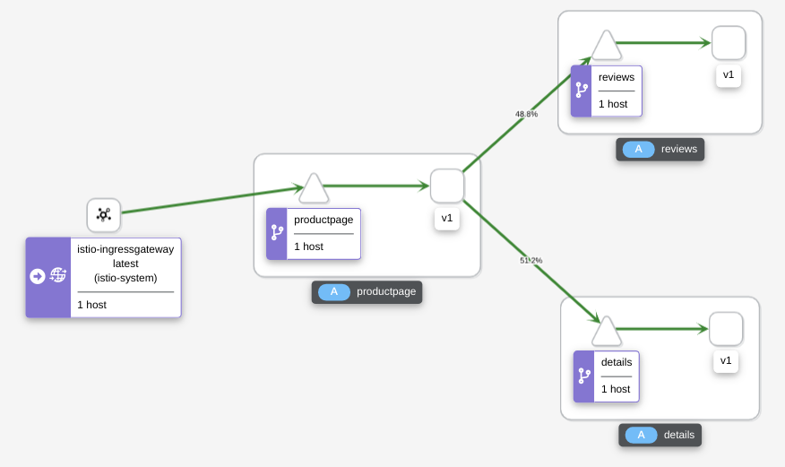

From the Istio documentation on [Traffic Management](https://istio.io/latest/docs/concepts/traffic-management/):

_Istio’s traffic routing rules let you easily control the flow of traffic and API calls between services. Istio simplifies configuration of service-level properties like **circuit breakers, timeouts, and retries**, and makes it easy to set up important tasks like **A/B testing, canary rollouts, and staged rollouts** with percentage-based traffic splits. It also provides out-of-box **failure recovery features** that help make your application more robust against failures of dependent services or the network._

_Istio’s traffic management model relies on the Envoy proxies that are deployed along with your services. All traffic that your mesh services send and receive (data plane traffic) is proxied through Envoy, making it easy to direct and control traffic around your mesh without making any changes to your services._

## Istio Ingress Gateway 

In Exercise 2, step 2 "Allow external access to application" you have applied an Istio configuration from the file `samples/bookinfo/networking/bookinfo-gateway.yaml`. Now we want to look at it. It has 2 parts:

#### Part 1: Gateway 

The gateway or ingress gateway is a form of load balancer that receives incoming HTTP or TCP connections. It configures exposed ports and protocols and contains the "host" name which is the domain main the gateway is supposed to answer.

Our example:

```
apiVersion: networking.istio.io/v1alpha3
kind: Gateway
metadata:
  name: bookinfo-gateway
spec:
  selector:
    istio: ingressgateway # use istio default controller
  servers:
  - port:
      number: 80
      name: http
      protocol: HTTP
    hosts:
    - "*"
```

1. The selector "istio: ingressgateway" maps to the istio-ingressgateway deployment in the istio-system namespace.
2. The servers section specifies HTTP protocol on port 80 and what is called a "wildcard" host "*". This means that this gateway will direct HTTP requests (unencrypted) on any IP address or domain name. This is actually bad practice but helps keeping this exercise relatively simple.

#### Part 2: Virtual Service 

A Virtual Service is used to configure the Istio traffic routing. Normally, you would use an Istio Virtual Service to add traffic routing rules to a Kubernetes service. Here we use it to configure an Istio Gateway.

Our example:

```
apiVersion: networking.istio.io/v1alpha3
kind: VirtualService
metadata:
  name: bookinfo
spec:
  hosts:
  - "*"
  gateways:
  - bookinfo-gateway
  http:
  - match:
    - uri:
        exact: /productpage
    - uri:
        prefix: /static
    - uri:
        exact: /login
    - uri:
        exact: /logout
    - uri:
        prefix: /api/v1/products
    route:
    - destination:
        host: productpage
        port:
          number: 9080
```

The configuration specifies:

* the wildcard ("*") host
* the "bookinfo-gateway" from part 1
* a number of routing rules

To access our Bookinfo sample app in the browser, we use the '/productpage' URI which routes to the productpage deployment on port 9080.

## Destination Rules

_Along with virtual services, destination rules are a key part of Istio’s traffic routing functionality. You can think of virtual services as how you route your traffic to a given destination, and then you use destination rules to configure what happens to traffic for that destination. Destination rules are applied after virtual service routing rules are evaluated, so they apply to the traffic’s “real” destination._

_In particular, you use destination rules to specify named service subsets, such as grouping all a given service’s instances by version. You can then use these service subsets in the routing rules of virtual services to control the traffic to different instances of your services._

Run the following command to create default destination rules for the Bookinfo services:

```
$ kubectl apply -f samples/bookinfo/networking/destination-rule-all.yaml
```

Look at the file, specifically at the DestinationRule for 'reviews':

```
apiVersion: networking.istio.io/v1alpha3
kind: DestinationRule
metadata:
  name: reviews
spec:
  host: reviews
  subsets:
  - name: v1
    labels:
      version: v1
  - name: v2
    labels:
      version: v2
  - name: v3
    labels:
      version: v3
```

Remember that there are 3 versions of the Review service: v1 does not use the Ratings service, v2 and v3 use the Ratings and display stars in black (v2) or red (v3).

Look at the file you used to deploy the Bookinfo application, `samples/bookinfo/platform/kube/bookinfo.yaml`, and there at the section "Reviews service":

There is:
1. a Service definition
2. a ServiceAccount definition
3. three different deployments, labelled "app: reviews" and "version: v1/2/3"

This DestinationRule above defines subsets with names v1, v2, and v3 for the three different deployments (version: v1, v2, or v3).


## Request Routing

Remember: The Istio Bookinfo sample consists of four separate microservices. Three different versions of one of the Reviews microservice have been deployed and are running concurrently. To illustrate the problem this causes, access the Bookinfo app’s /productpage in a browser and refresh several times. You’ll notice that sometimes the book review output contains star ratings and other times it does not, sometimes the stars are black, sometimes red. This is because without an explicit default service version to route to, Istio routes requests to all available versions in a round robin fashion.

This task shows you how to route requests dynamically to multiple versions of a microservice (Reviews, version v1, v2, or v3).

To route to one version only, you apply virtual services that set the default version for the microservices. In this case, the virtual services will route all traffic to v1 of each microservice.

Run the following command to apply the virtual services:

```
$ kubectl apply -f samples/bookinfo/networking/virtual-service-all-v1.yaml
```

Look at the file, specifically at the VirtualService for Reviews:

```
apiVersion: networking.istio.io/v1alpha3
kind: VirtualService
metadata:
  name: reviews
spec:
  hosts:
  - reviews
  http:
  - route:
    - destination:
        host: reviews
        subset: v1
```

Note how it specifically selects the subset v1 created with the DestinationRule from the previous section.

When you test the Bookinfo  app in your browser you can see that Book Reviews area never shows stars, only text. This means we no longer use v2 or v3 of the Reviews service.

## Request Routing based on Header information

Have you noticed the "Sign in" button in the black title bar of the Bookinfo sample? It obviously allows you to "sign in" to the application. Of course there is no user registry and security implemented in the app. The "sign in" places a piece if information in the HTTP header.

Open the Bookinfo sample **a second time in a private(!) browser tab** and sign in as user "jason" (small letters!) and anything for a password.

Now apply a new VirtaulService definition on the Reviews service:

```
$ kubectl apply -f samples/bookinfo/networking/virtual-service-reviews-test-v2.yaml
```

Refresh the two browser sessions (private with user jason and non-private). The non-private browser still shows Reviews v1 (without stars), the private session with user jason shows Reviews v2 with black stars.

Look at the definition you applied:

```
apiVersion: networking.istio.io/v1alpha3
kind: VirtualService
metadata:
  name: reviews
spec:
  hosts:
    - reviews
  http:
  - match:
    - headers:
        end-user:
          exact: jason
    route:
    - destination:
        host: reviews
        subset: v2
  - route:
    - destination:
        host: reviews
        subset: v1
```

There are 2 rules: 

* A "matching" rule (end-user == jason) routes to "host: reviews, subset: v2"
* A "default" route routes to "host: reviews, subset: v1"

There are endless possibilities with this: 

* You could secure your application with an Identity and Access Management system like Keycloak and offer different features in your application simply by evaluating HTTP Header settings added by Keycloak.
* You can display different versions of your application depending on the make of the Browser you use or the language version requested

## Traffic Shifting using Weight-based Routing

A common use case is to migrate traffic gradually from an older version of a microservice to a new one. In Istio, you accomplish this goal by configuring a sequence of routing rules that redirect a percentage of traffic from one destination to another.

In this task, you will use send 50% of traffic to reviews:v1 and 50% to reviews:v3.

1. Reset the previously applied rules:

    ```
    $ kubectl apply -f samples/bookinfo/networking/virtual-service-all-v1.yaml
    ```

2. Check the Bookinfo app in the browser. It should show v1 only (no stars in Reviews).

3. Create load on the application (Exercise 3, "Accessing the Telemetry services").

4. Look at the Kiali dashboard:

    

5. Transfer 50% of the traffic from reviews:v1 to reviews:v3 with the following command:

    ```
    $ kubectl apply -f samples/bookinfo/networking/virtual-service-reviews-50-v3.yaml
    ```

    Wait a few seconds for the new rules to propagate.


6. Check the Bookinfo app in the browser. It should now show v1 (no stars in Reviews) and v3 (red stars).

7. Look at the Kiali dashboard:

    

    It will take a while until the distribution between v1 and v3 are getting close to 50% / 50 %.

Look at the configuration you applied:

```
apiVersion: networking.istio.io/v1alpha3
kind: VirtualService
metadata:
  name: reviews
spec:
  hosts:
    - reviews
  http:
  - route:
    - destination:
        host: reviews
        subset: v1
      weight: 50
    - destination:
        host: reviews
        subset: v3
      weight: 50
```

In a real life situation, you would probably begin with a weight 99 for v1 and weight 1 for v3 (99:1 distribution) and gradually lower weight for v1 and increase weight for v3 until you are confident that v3 works well.


---

## >> [Continue with Exercise 5](exercise5.md)