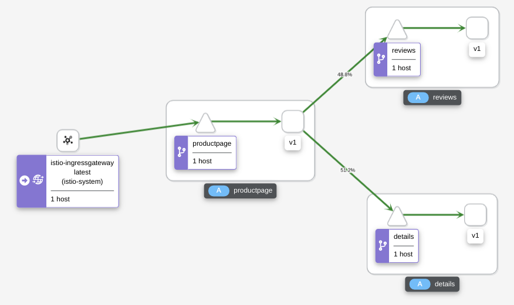
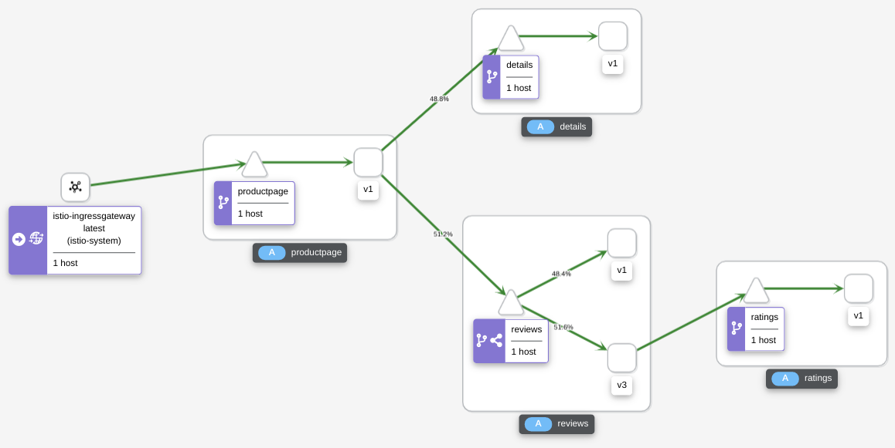
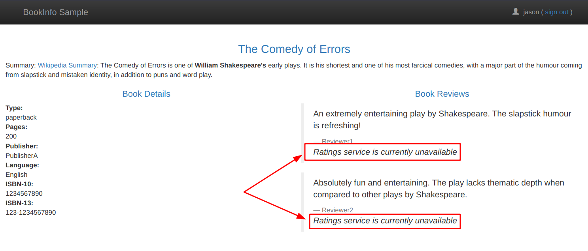
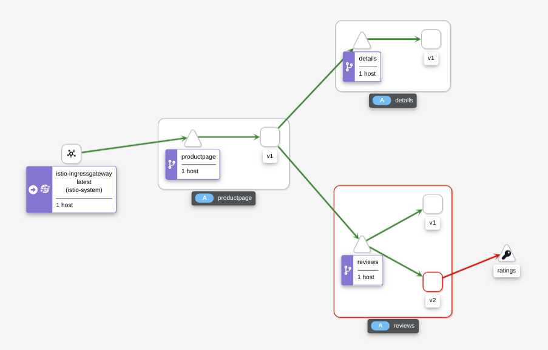

## Request Routing [&#10162;](https://istio.io/latest/docs/tasks/traffic-management/request-routing/)

Remember: The Istio Bookinfo sample consists of four separate microservices. Three different versions of one of the Reviews microservice have been deployed and are running concurrently. To illustrate the problem this causes, access the Bookinfo app’s /productpage in a browser and refresh several times. You’ll notice that sometimes the book review output contains star ratings and other times it does not, sometimes the stars are black, sometimes red. This is because without an explicit default service version to route to, Istio routes requests to all available versions in a round robin fashion.

This task shows you how to route requests dynamically to multiple versions of a microservice (Reviews, version v1, v2, or v3).

To route to one version only, you apply a virtual service configuration that sets the default version of the microservice. In this case, the virtual service configurations will route all traffic only to v1 of each microservice.

Run the following command to apply the virtual services:

```
kubectl apply -f samples/bookinfo/networking/virtual-service-all-v1.yaml
```

Look at the file, specifically at the VirtualService for Reviews:

```
apiVersion: networking.istio.io/v1alpha3
kind: VirtualService
metadata:
  name: reviews
spec:
  hosts:
  - reviews
  http:
  - route:
    - destination:
        host: reviews
        subset: v1
```

Note how it specifically selects the subset v1 created with the DestinationRule from the previous section.

When you test the Bookinfo  app in your browser you can see that Book Reviews area never shows stars, only text. This means we no longer use v2 or v3 of the Reviews service.

## Request Routing based on Header information

Have you noticed the "Sign in" button in the black title bar of the Bookinfo sample? It obviously allows you to "sign in" to the application. Of course there is no user registry and security implemented in the app. The "sign in" places a piece if information in the HTTP header.

Open the Bookinfo sample in a different browser and sign in as user "jason" (small letters!) and anything for a password.

**Note bwLehrpool:** There is only Firefox available in bwLehrpool so this part doesn't work. Sorry about that! Continue with 'Traffic Shifting'.

Now apply a new VirtualService definition on the Reviews service:

```
kubectl apply -f samples/bookinfo/networking/virtual-service-reviews-test-v2.yaml
```

Refresh the two browser sessions (private with user jason and non-private). The non-private browser still shows Reviews v1 (without stars), the private session with user jason shows Reviews v2 with black stars.

Look at the definition you applied:

```
apiVersion: networking.istio.io/v1alpha3
kind: VirtualService
metadata:
  name: reviews
spec:
  hosts:
    - reviews
  http:
  - match:
    - headers:
        end-user:
          exact: jason
    route:
    - destination:
        host: reviews
        subset: v2
  - route:
    - destination:
        host: reviews
        subset: v1
```

There are 2 rules: 

* A "matching" rule (end-user == jason) routes to "host: reviews, subset: v2"
* A "default" route routes to "host: reviews, subset: v1"

There are endless possibilities with this: 

* You could secure your application with an Identity and Access Management system like Keycloak and offer different features in your application simply by evaluating HTTP Header settings added by Keycloak.
* You can display different versions of your application depending on the make of the Browser you use or the language version requested

## Traffic Shifting [&#10162;](https://istio.io/latest/docs/tasks/traffic-management/traffic-shifting/) using Weight-based Routing

A common use case is to migrate traffic gradually from an older version of a microservice to a new one. In Istio, you accomplish this goal by configuring a sequence of routing rules that redirect a percentage of traffic from one destination to another.

In this task, you will use send 50% of traffic to reviews:v1 and 50% to reviews:v3.

1. Reset the previously applied rules:

    ```
    kubectl apply -f samples/bookinfo/networking/virtual-service-all-v1.yaml
    ```

2. Check the Bookinfo app in the browser. It should show v1 only (no stars in Reviews).

3. Create load on the application (Exercise 3, "Accessing the Telemetry services").

4. Look at the Kiali dashboard:

    

5. Transfer 50% of the traffic from reviews:v1 to reviews:v3 with the following command:

    ```
    kubectl apply -f samples/bookinfo/networking/virtual-service-reviews-50-v3.yaml
    ```

    Wait a few seconds for the new rules to propagate.


6. Check the Bookinfo app in the browser. It should now show v1 (no stars in Reviews) and v3 (red stars).

7. Look at the Kiali dashboard:

    

    It will take a while until the distribution between v1 and v3 is getting close to 50% / 50 %.

Look at the configuration you applied:

```
apiVersion: networking.istio.io/v1alpha3
kind: VirtualService
metadata:
  name: reviews
spec:
  hosts:
    - reviews
  http:
  - route:
    - destination:
        host: reviews
        subset: v1
      weight: 50
    - destination:
        host: reviews
        subset: v3
      weight: 50
```

In a real life situation, you would probably begin with a weight 99 for v1 and weight 1 for v3 (99:1 distribution) and gradually lower weight for v1 and increase weight for v3 until you are confident that v3 works well.


## Fault Injection [&#10162;](https://istio.io/latest/docs/tasks/traffic-management/fault-injection/)

Resiliency is an important aspect of any type of application: if something goes wrong, the application should handle it in a sensible manner. Simply terminating or displaying a stack trace to your end users is not a good option. This is critical for microservices because there is a lot of communication between the services, especially if there are external services involved. How can you test the behaviour of your microservices in case of an error? With Istio Fault Injection!

Fault Injection allows to introduce artificial problems into a perfectly healthy application. This includes:

* HTTP delays: a microservice responds to a request after x seconds, simulating a comms or performance problem
* HTTP abort: a request is terminated with a HTTP 5xx error, simulating a server error

We will test an example of an HTTP abort fault.

First "reset" your configuration:

```
kubectl apply -f samples/bookinfo/networking/virtual-service-all-v1.yaml
kubectl apply -f samples/bookinfo/networking/virtual-service-reviews-test-v2.yaml
```

We have used the second configuration before: user jason uses v2 of Reviews, everybody else uses v1.

Now create a fault injection rule to send an **HTTP abort for user jason**:

```
kubectl apply -f samples/bookinfo/networking/virtual-service-ratings-test-abort.yaml
```

If you test the application as **user jason** now, you will see the error "Ratings service is currently unavailable". 

This is a simple example for resiliency: there is nothing you can do about the service being unavailable but your users get comprehensible information and not a cryptic error code.



And this is the configuration we just applied:

```
apiVersion: networking.istio.io/v1alpha3
kind: VirtualService
metadata:
  name: ratings
spec:
  hosts:
  - ratings
  http:
  - match:
    - headers:
        end-user:
          exact: jason
    fault:
      abort:
        percentage:
          value: 100.0
        httpStatus: 500
    route:
    - destination:
        host: ratings
        subset: v1
  - route:
    - destination:
        host: ratings
        subset: v1
```

There is a matching rule for end-user jason. This user gets a fault of type abort, resulting in a HTTP 500 error code every time (value: 100.0) the Ratings service is called.

As you can see, Istio allows the errors to be random if you choose a percentage lower than 100.

Have a look at Kiali, too. It can show you areas of trouble at a glance:



---

# Clean up

If you no longer need your Minikube cluster you can simply delete it with:

```
minikube delete
```

**Congratulations, you made it! This concludes our workshop.**

There is a lot more that Istio can do but we only have limited time for this hands-on. If you are interested have a look at the [Istio documentation](https://istio.io/docs).